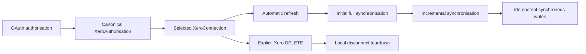

# Xero simplification design

Date: 7 October 2026. Repository inspected: `338f86f521d70dccecdc2713c4b5a0e7dbd463bf`.
Status: planning complete after self-review; production implementation has not started.

## 1. Brief and boundaries

Replace Team Calendar's Xero connection lifecycle with the smallest production-quality implementation of the approved flow:



This is an architectural planning task using Superpowers brainstorming and writing-plans. The user has approved the direction and explicitly requested both written artefacts in this turn. Additional approval gates and alternative product designs are unnecessary for this planning-only deliverable. Stop after these documents and the requested lesson are complete and self-reviewed.

There are no production users, Xero connections, customer Xero data migrations or backwards-compatibility requirements. Destructive schema changes are acceptable. Do not implement transitional readers, credential mirrors, per-binding cutover, backfills or historical reservation support.

Preserve Clerk Organisation and payroll Organisation isolation, Xero as payroll/balance source of truth, synchronous user-triggered outbound writes, canonical people/availability/feed identities, existing AU submission semantics, and separate AU/NZ/UK adapters. Activation remains AU-only; retaining regional adapters does not enable NZ/UK product flows. Keep the present Next.js, Bun, Prisma/PostgreSQL, Clerk, Inngest and Redis stack and Australian English copy. Do not add a generic accounting-provider abstraction, dependencies, a payroll accrual engine or an outbound queue.

## 2. Repository evidence and selected approach

Read `AGENTS.md`, `tasks/lessons.md`, `PRODUCT.md`, `README.md`, ScreenCatalogue's Xero/integration/sync/connect sections, both `plans/160-*` documents and both `plans/161-*` documents. Inspected OAuth/crypto/access/transport/regional adapters, database schema and query boundaries, all Xero jobs, API routes, settings actions/DTOs, domain writes, release tooling and associated tests. Parallel research was authorised by `AGENTS.md`; it was read-only.

| Finding | Consequence |
| --- | --- |
| `oauth/service.ts` combines canonical owners, legacy per-connection tokens, duplicated session credentials, reservations and cleanup dispatch | Replace it with small OAuth, authorisation and disconnect modules; keep exactly one credential store |
| Current consent requests Pay Runs scopes; no production PayRuns call exists | Remove both Pay Runs scopes |
| Settings are read through PayItems; employee/leave mutations need employees write permission | Remove settings write and redundant employees read scope |
| AU employee and leave workers fully enumerate provider pages; no request uses `If-Modified-Since` | Implement supported provider watermarks; distinguish full and incremental completeness |
| Existing `cursor_value` tracks local person batches, including 40-person balance batches | Preserve useful rolling progress, but move it to named connection fields; reserve `XeroSyncCursor` for provider watermarks |
| No outbound request sends `Idempotency-Key` | Add provider-native keys to supported mutations; preserve the journal for uncertainty beyond key expiry |
| Current disconnect disables locally before a cleanup request is processed | Reverse the order and return an honest synchronous result |
| The scheduler already rotates dormant credentials at 45 days | Preserve that policy, deduplicated by authorisation and including paused connections |
| ScreenCatalogue describes duplicate initial sync, but the current connect action dispatches the durable initial job only | Keep one queued initial import; update the stale catalogue rather than restore an inline import |

A per-connection token store is smaller superficially but violates Xero's user/app token ownership and rotation rules. A canonical authorisation plus selected connection matches provider guidance and is selected. The existing Plan 161 owner/provenance/attempt/cleanup architecture adds durable recovery and compatibility states without a current requirement and is rejected. These are implementation comparisons, not reopened product decisions.

## 3. Current provider contract and scopes

Official material was retrieved on 7 October 2026 through web search and direct Xero OpenAPI downloads. Context7 was consulted for `/xeroapi/xero-openapi` and `/prisma/web`. Some direct developer-site opens return a JavaScript shell; readable official indexed content and the raw official specifications supply the contracts below. The historical Plan 161 ledger was not treated as fresh evidence. Documentation verification does not prove live app entitlement, granted consent or successful wire operations.

| Contract | Decision and authoritative source |
| --- | --- |
| Standard code flow | Server redirects with state and registered redirect URI; exchanges the single-use code using server-held client credentials. [Auth flow](https://developer.xero.com/documentation/guides/oauth2/auth-flow/), [OAuth FAQ](https://developer.xero.com/faq/oauth2) |
| Credential ownership | Tokens belong to Xero user + app; another authorisation for that pair supersedes earlier tokens. Canonical user token storage plus tenant records is provider-native. [Managing tokens and IDs](https://developer.xero.com/documentation/best-practices/data-integrity/managing-tokens/) |
| Expiry and refresh | Access tokens last up to 30 minutes, unused refresh tokens up to 60 days. Replace both tokens together. The old refresh token can recover a lost response/save within a 30-minute grace period. [Token types](https://developer.xero.com/documentation/guides/oauth2/token-types/) |
| Tenant discovery | User bearer token calls `GET /connections`; optional `authEventId` identifies tenants consented in the current flow. DELETE targets its connection `id`, not `tenantId`, and does not revoke sibling token access. [Connections](https://developer.xero.com/documentation/best-practices/managing-connections/connections/), [Identity OpenAPI](https://github.com/XeroAPI/Xero-OpenAPI/blob/master/xero-identity.yaml) |
| AU incremental reads | `GET /Employees` and `GET /LeaveApplications/v2` declare `If-Modified-Since`, pagination and employees permissions. [AU OpenAPI](https://github.com/XeroAPI/Xero-OpenAPI/blob/master/xero-payroll-au.yaml) |
| AU leave semantics | V2 includes requested/rejected leave; create schedules leave. Approve applies to requested leave; reject applies to requested or scheduled leave not already included in a pay run. [AU Leave Applications](https://developer.xero.com/documentation/api/payrollau/leaveapplications) |
| Regional differences | NZ/UK employee and employee-leave GETs declare paging/filter or per-employee reads, but no equivalent modification header. Keep explicit regional capabilities; do not infer AU semantics. [NZ OpenAPI](https://github.com/XeroAPI/Xero-OpenAPI/blob/master/xero-payroll-nz.yaml), [UK OpenAPI](https://github.com/XeroAPI/Xero-OpenAPI/blob/master/xero-payroll-uk.yaml) |
| Provider idempotency | AU create/update/approve/reject declare `Idempotency-Key`; NZ/UK leave POST/PUT also declare it. Keys are app-wide, at most 128 characters and retained for six minutes. A changed URL/method/body cannot reuse a key; cached internal failures require resource inspection before a new key. [Idempotency guide](https://developer.xero.com/documentation/guides/idempotent-requests/idempotency/) and regional OpenAPI |
| Quotas and support tracing | Honour tenant/app limits and `Retry-After`; record correlation response headers. [API limits](https://developer.xero.com/documentation/best-practices/api-call-efficiencies/rate-limits/), [Troubleshooting](https://developer.xero.com/documentation/guides/oauth2/troubleshooting/) |

Final consent string, in this order:

```text
offline_access accounting.settings.read payroll.employees payroll.settings.read
```

| Scope | Implemented requirement |
| --- | --- |
| `offline_access` | Scheduled access and automatic token refresh |
| `accounting.settings.read` | Existing `GET /api.xro/2.0/Organisation` country/region discovery; the official Accounting spec declares settings permissions |
| `payroll.employees` | AU leave create, approve and reject, plus employee/leave/balance reads covered by the read/write grant |
| `payroll.settings.read` | AU PayItems leave-type metadata |

Remove `payroll.payruns`, `payroll.payruns.read`, `payroll.employees.read` and `payroll.settings`. No PayRuns or payroll-settings mutation is implemented. Read/write employees permission covers its reads; capability checks must recognise this instead of demanding an additional `.read` scope. Do not request OpenID/profile/email for identity that is already verifiable in the access token, or `app.connections` for normal user-token disconnect. Validate actual granted scopes from the token response or verified access-token claims, never assume requested equals granted.

## 4. Persistent model

All four tables retain UUID identity and created/updated timestamps. Connections, sessions and cursors carry `clerk_org_id` and payroll `organisation_id` where known. Canonical authorisations are server-only system credentials because one verified Xero user/app grant can legitimately support connections in more than one Clerk account. This grants no payroll data visibility or management permission across accounts.

### XeroAuthorisation (`xero_authorisations`)

- Unique `(provider_app_id, xero_user_id)`, using the configured Xero client ID and cryptographically verified `xero_userid`.
- One AES-256-GCM encrypted access token and one encrypted refresh token: `access_token_encrypted`, `access_token_iv`, `access_token_auth_tag`, `refresh_token_encrypted`, `refresh_token_iv`, `refresh_token_auth_tag`, `token_key_version` and `token_encrypted_at`.
- `access_token_expires_at`, actual `granted_scopes`, `status` (`active` or `reconnect_required`), `last_refreshed_at`, and safe `last_refresh_error_code`/`last_refresh_error_at`.
- `last_refreshed_at` means successful rotation; initial adoption initialises it to the token acquisition time. A failed request never advances it.
- No token mirror, previous-token envelope, token-version counter, refresh-attempt relation, lease, campaign identity or cleanup state.
- Preserve the existing keyring and authenticated crypto utilities. Restrict any re-encryption utility to this table and the same credential lock; remove old multi-table recovery traversal.

### XeroConnection (`xero_connections`)

- `organisation_id` unique, Clerk ownership, canonical `xero_authorisation_id` FK, external `xero_tenant_id`, `remote_connection_id`, `tenant_name`, `tenant_type`, `payroll_region` and optional `auth_event_id`.
- Local `status`: `active`, `reconnect_required`, `disconnected`. A normal expired access token does not make a connection disconnected. Authorisation failure can derive reconnect-required display for every linked connection without mirroring credentials/state into each row.
- `sync_paused_at`, connection/disconnection audit timestamps and safe sync-error fields.
- Existing per-entity sync and staleness timestamps move here. Add truthful `initial_sync_requested_at` and `initial_sync_completed_at` plus `last_full_people_sync_at` and `last_full_leave_records_sync_at`.
- Real rolling workload progress: `balance_next_person_id` and existing regional `leave_next_person_id`, both nullable. These are local roster continuation, not provider modification watermarks.
- Use direct unique external tenant and selected remote connection IDs for the configured single app. This preserves the existing one-local-payroll-binding policy with ordinary constraints rather than slots/reservations. A foreign conflict response reveals no account details.
- Retain external tenant identity on a disconnected row for same-file reconnect and retained source records. Reject attaching a different payroll file to an organisation containing the previous file's records; use an ordinary new payroll organisation instead. No transfer/replacement workflow or reservation history is introduced.
- Authorisation and remote connection ID are non-null for active connections, nullable after confirmed disconnect. Clear them during local teardown. Never delete a credential still referenced by another connection or unexpired selection session.

### XeroOAuthSession (`xero_oauth_sessions`)

- Initiating Clerk account/user, optional intended payroll organisation, hashed random state and browser nonce, safe return path, expiry, one-shot callback claim, optional `xero_authorisation_id` reference and temporary validated tenant-selection context.
- One 10-minute lifetime for state, nonce cookie and selection. Minimal phases: `pending`, `exchanging`, `selecting`, `completed`, `cancelled`; expired rows are removed. A callback replay cannot exchange the code twice.
- No credentials, expected binding generation, provider-record provenance, candidate envelopes or refresh recovery. Tokens are adopted directly into the canonical authorisation after exchange and identity verification.
- Expire/delete session rows during the existing scheduler's housekeeping. Unreferenced credentials may be removed after no connection or live session uses them; do not infer remote deletion from local expiry.

### XeroSyncCursor (`xero_sync_cursors`)

- Scoped connection FK and entity (`people`, `leave_records`), unique `(xero_connection_id, entity_type)`, nullable UTC `modified_since`.
- This records a completed provider traversal watermark. It is not an arbitrary string, provider inventory cursor, OAuth cursor, cleanup cursor or local person pagination cursor.
- Only AU endpoints with documented modification filters use it. Do not create artificial NZ/UK watermarks or balance watermarks when those endpoints do not support them.

### Domain references and schema change policy

Replace internal `XeroTenant.id` FKs on `LeaveBalance` and `SyncRun` with `xero_connection_id`; update their uniqueness/indexes and the manual-balance partial unique index. Retain all person, matching, availability, publication, feed, audit, failed-record and leave-operation entities.

Add scoped composite Organisation identity `(id, clerk_org_id)` and connection identity `(id, clerk_org_id, organisation_id)`. Enforce composite FKs for connection/session ownership and cursor/balance/run connection references. Continue filtering both tenant keys on reads, updates and deletes even when IDs are unique. System credential access must first establish an authorised scoped connection, or run within the narrow internal maintenance boundary.

Use one new Prisma-generated destructive schema-only migration. Preserve the existing migration history and unrelated domain constraints; do not rebaseline the whole database or hand-edit generated migrations. Declare the manual-balance partial unique index in the schema with Prisma 7's existing `partialIndexes` preview support so the changed predicate is generated rather than edited into SQL. This requires no package upgrade; [Prisma 7.4 introduced schema/migration support](https://github.com/prisma/web/blob/main/apps/site/content/changelog/2026-02-11.mdx). Generate/apply on disposable databases with no Xero fixtures, then prove the complete fresh migration chain reaches the target schema. Obsolete historical SQL may create tables later dropped by the new migration; it is not an active compatibility path. No customer data migration, backfill or dual-read deployment is required.

## 5. OAuth and selected tenant

1. Authenticate current Clerk user and owner/admin role. Validate the intended payroll organisation through both scope keys; do not trust query-string account/user identity. Create short-lived state/nonce and a session. Keep HTTP-only, secure-in-production, SameSite=Lax nonce cookies and local safe return paths. Preview callbacks remain disabled unless explicitly registered in existing configuration.
2. Validate state, nonce, expiry, current user/account, current management role and single-use claim before code exchange. Denial follows the same state protection, closes the session and clears the cookie. Clear the cookie on terminal validation failures too.
3. Exchange once using form encoding and HTTP Basic client credentials, the exact registered redirect URI and a bounded deadline. A lost code-exchange response means restart authorisation, not code replay or a durable token recovery protocol.
4. Verify access-token signature/issuer/audience/client ID/expiry and `xero_userid` using existing JOSE/JWKS verification. Remove legacy expired-token verification. Adopt encrypted credentials and actual scopes atomically in the canonical authorisation; reauthorisation updates that row and its existing linked consumers.
5. Call `/connections` with the canonical user token; use `authentication_event_id`/`authEventId` to highlight current consent, not as proof an unfiltered list is app-wide inventory. Preserve existing authorised tenants for same-file reconnect. Reject malformed inventories rather than silently declaring incomplete lists complete. Accept only `ORGANISATION` tenant types for payroll.
6. Before selection, reload fresh user inventory, validate the exact selected tenant/connection tuple and session scope, discover country through Organisation, enforce the Clerk account's country and AU activation, and attach/create the ordinary payroll organisation. Existing connections select only their existing external file. Commit connection/session consumption and audit atomically.
7. Dispatch one initial full-sync event after commit. Event failure does not undo a saved connection; the existing scheduler recovers active connections lacking initial completion. Preserve real matching/default holiday/feed setup and analytics best effort. Never run a second inline initial import.

A different authoriser may reconnect the same file only after the previous selected remote link has been explicitly removed or established absent. Do not silently lose the old remote link by overwriting its ID. If the previous grant cannot perform that deletion, require reauthorisation by that authoriser or Xero-side removal first. This is an explicit user recovery path, not a new background cleanup system.

## 6. One automatic refresh path

Expose a server-only `resolveXeroAccess({ clerkOrgId, organisationId, connectionId?, capability, deadline? })` from `packages/xero/src/oauth/authorisation.ts`. It proves scoped active connection and capabilities and returns an immutable request context. Apps never retrieve credentials by a caller-supplied raw authorisation ID.

Refresh when expiry is within two minutes, or maintenance finds the last successful rotation at least 45 days old. On a definite normal API 401, reload canonical credentials and refresh/replay at most once; concurrent callers that already rotated the token satisfy the retry without another rotation. Permission denial is not an automatic refresh loop.

Use bounded PostgreSQL transaction advisory locks, encapsulated in `packages/database`, rather than process-local promises or durable leases. Refresh locks the canonical `(provider_app_id, xero_user_id)` identity and rereads the row before deciding. Credential re-encryption/replacement uses the same identity lock. No mirror is updated.

Because a first callback's Xero identity is unknown until exchange, protect token issuance from overlapping reauthorisation too: code exchange/adoption takes a short exclusive app advisory lock; ordinary refresh takes that app lock in shared mode before its exclusive authorisation lock. Lock order is app then authorisation. Independent users' refreshes remain concurrent, while a new grant cannot race an old refresh or another code exchange. This is two SQL locks without additional durable infrastructure, justified by documented superseding grants, not a distributed recovery framework.

Token HTTP work has a 10-second total budget; transaction timeout is 15 seconds and pool acquisition/lock waits are bounded within that budget. Release locks on commit/rollback. Test with real PostgreSQL and both configured adapters; never silently replace this with an in-memory mutex.

On success encrypt and replace access token, refresh token, expiry, actual scopes and successful-refresh metadata in one transaction. On response loss or rollback, the canonical old refresh token remains available for a bounded retry under the same lock. Use Xero's 30-minute grace; do not store a second credential copy or attempt journal. Retry transient failures promptly within the operation/Inngest retry budget. If recovery occurs after the grace window and returns `invalid_grant`, require reconnect. The design deliberately does not promise recovery from an unattended outage longer than provider grace.

`invalid_grant` marks the authorisation reconnect-required and stops payroll access for its linked connections; `invalid_client` is app configuration failure. Network/429/5xx do not establish revocation. The existing 15-minute scheduler runs a daily due-authorisation check, deduplicates shared grants and refreshes those with any active connection, including paused sync connections. It does not classify usage, archive accounts or disconnect inactive customers.

## 7. Synchronisation

Initial import is people, leave and provider balances in that order, using Inngest steps and the existing run lifecycle. It must fully traverse the roster before setting `initial_sync_completed_at`; one 40-person balance page is not a completed full import. Completion is conditional on the event's `requestedAt` still matching `initial_sync_requested_at`, so an old run cannot complete a newer reconnect request. A reconnect preserves domain IDs/feeds and triggers a full reconciliation without clearing useful records.

Scheduled people/leave cadence stays 15 minutes on weekdays 07:00 to 18:59 local and hourly otherwise. Balances remain rolling hourly. Dispatch one nightly full people/leave reconciliation during 01:00 to 02:59 local plus existing inbound approval reconciliation. Manual admin sync is an explicit full reconciliation.

For AU incremental employees and V2 leave:

- Capture run start before fetching. Request every page with the same previous `modified_since` minus a two-minute overlap, formatted as UTC seconds, and documented page size 100. The overlap is application policy.
- Upsert by existing remote keys and hashes; maintain per-record source timestamps. Empty complete deltas are valid. Never infer absence/archive from a delta.
- Advance `modified_since` to run start only after complete traversal and all relevant records are persisted. Keep it unchanged on malformed rows/envelopes, page limits, failed upserts or incomplete traversal; record partial progress/failures without losing retryable records.
- Full traversal omits the header and may archive absent Xero-owned records only when the complete unfiltered set was successfully processed. A full failure cannot archive records or advance the watermark. It never archives Team Calendar manual entries.
- Guard cursor commit by prior watermark and scope; a delayed job cannot move it backwards. Under the existing run/concurrency controls, reread scoped active connection and expected external tenant before persistence. No binding generations are needed.

NZ/UK adapters keep provider-supported paging and per-employee leave/balance reads, with explicit absence of a modification-filter capability. Retain current rolling employee-batch continuation where used; full reconciliation handles removal. Do not simulate provider incremental support with local last-sync time.

Balance polling remains provider-derived, paged at 40 people with atomic continuation and targeted-person refresh that does not move the roster cursor. Preserve hours/days/currency and raw audited values; never calculate or convert balances. A partial roster page must not clear whole-roster staleness. Preserve initial dispatch recovery, run deduplication, cancellation, failed-record isolation, Xero person matching/field ownership and downstream publication invalidation.

## 8. Synchronous idempotent writes and central HTTP

Preserve `au-contract-v1`: submit locally; manager approval creates scheduled leave; local decline/withdraw make no provider call; imported requested leave uses approve/reject; supported remote withdrawal uses reject and protects processed leave. Preserve AU array-shaped bodies and omit guessed leave units/periods for date-only creation. Region differences remain in separate adapters.

Reuse `OutboundOperation` as the domain write journal. Its `attempt_generation` protects actual leave operations and is not the deleted connection `binding_generation`. Extend the same journal to remote approve/decline/withdraw where replay needs durable request identity; do not add a second journal. Keep immutable actor/fingerprint, exact target/body, request identity and observed remote ID. The new timing columns are `idempotency_first_dispatched_at` and `idempotency_replay_before`; existing dispatch/accepted/completed timestamps keep their domain meanings.

Persist a UUID key (36 characters, unique per app operation), external tenant, method, URL/body fingerprint and first dispatch time before supported POST/PUT/PATCH. All short in-request retries use exactly that request and key. The application replay cutoff is five minutes from first dispatch, conservatively inside Xero's six-minute retention; retries never extend it. No automatic replay after the cutoff or after a changed body/URL/tenant. A lost response or local-save failure can be recovered with the same key within the window; after it expires, use an authoritative GET and the existing administrator recovery before creating anything again. A cached 5xx never justifies minting a new key. Completed operations return their stored outcome and apply audit/notification/publication once. Outbound jobs never replay payroll mutations.

Keep one `xeroFetch` HTTP boundary for token, inventory, metadata, payroll and DELETE requests. Retain the shared atomic limiter because app/API/jobs run across workers: five concurrent per external tenant, 60/minute per tenant, configured 1,000/day Starter or 5,000/day higher tiers, and 10,000/minute app-wide. Ordinary Redis keys initialise atomically on first use; remove credential-domain sentinels, namespace epochs and manual admission bootstrap. Store failure denies a call rather than bypassing quotas.

Retain bounded response/body/deadline handling and host restrictions. Policy is explicit: reads retry transient failures; auth-code exchange is single attempt; refresh uses only its bounded grace-aware path; supported mutations replay the same key within cutoff; unsupported mutations never retry an ambiguous outcome; DELETE is bounded and cannot pretend timeout means success. Default maximum four HTTP attempts including first; token calls at most two refresh attempts and one code attempt, payroll writes share the existing 120-second operation ceiling. Parse seconds/date `Retry-After`, do not sleep beyond the absolute deadline, and release rate leases reliably. Inngest controls later inbound retries. Log safe method/endpoint, status, retry delay and `Xero-Correlation-Id` or `X-Correlation-Id`, never tokens, OAuth codes/state or sensitive raw payroll bodies.

## 9. Remote-delete-first disconnect and revoked access

Owner/admin disconnect is a synchronous operation against the exact scoped selected connection. Preserve existing confirmation and optional retained-data versus purge behaviour. Both modes use identical remote deletion semantics.

1. Resolve ownership and fresh canonical user access. Serialise selection/disconnect for this connection; reject while a payroll operation has an active or uncertain write outcome. Do not race remote payroll creation with teardown.
2. Call `DELETE https://api.xero.com/connections/{remote_connection_id}`. User-token DELETE needs no additional consent scope or tenant header. Accept documented 204 or resource-not-found 404 for this owned target, never a generic network/auth error.
3. Only after that result, atomically mark disconnected, stop local scheduling, clear selected remote-link/authorisation references, clear provider cursors/rolling progress, and apply the selected data retention/purge transaction. Preserve manual entries and their relationships. Existing publication/feed invalidation remains intact. Delete canonical credentials only if no other connection or live session needs them; do not revoke a shared user grant.
4. On DELETE timeout, 429 beyond budget, 5xx or unusable grant, retain local data/credentials and return a plain-language failure. A retry remains possible; remote DELETE is naturally repeatable. A response-loss or post-DELETE DB failure can be retried to confirmed absence. No cleanup request, attempts, reconciliation worker, pending-remote-success receipt or report-only switch exists.

Remove `management-client.ts` and its app-management cache/token path. An unusable user grant is recovered through reauthorisation or removal in Xero followed by fresh authorised confirmation. No shipped offline billing cancellation requires independent app-management credentials. If that product requirement appears later, evaluate a narrow management DELETE then; do not retain dormant infrastructure now.

External Xero disconnect is detected by a successful user inventory lacking this recorded link or a definite tenant-auth failure after the one allowed refresh/inventory check. Mark only the affected connection reconnect-required; a user token may still access sibling tenants. Unreadable/malformed inventory and transient API failures do not prove absence. A grant-wide `invalid_grant` affects all consumers of that authorisation. Neither path destroys canonical payroll history or claims a provider cleanup succeeded.

## 10. Deletions and retained necessities

Delete models/tables `XeroCredentialOwner`, `XeroRefreshAttempt`, `XeroProviderConnection`, `XeroTenant`, `XeroCleanupRequest`, `XeroCleanupAttempt`, `XeroInactivityClassification` and their dedicated enums. Delete binding generations/slots/reservations, connection/session credential copies, legacy refresh/adoption readers, manual refresh actions, management-token infrastructure, cleanup/reissue jobs/scripts, behavioural inactivity reports, and Xero backfill/identity migration artefacts.

Delete Plan 161's 40-case evidence mandate and the Xero campaign control plane (runtime action/provider interception, campaign database access/leases, evidence collector/ledger/producers/authority, dedicated runner and obsolete browser scenarios). Retain ordinary fixture ownership/cleanup, non-local database test guards, source gates, generic release tooling and actual AU/browser/provider assertions. Remove only the campaign dependence from shared feed/job/domain modules. The plan contains exact deletion and consumer inventories.

Retained infrastructure has a demonstrated requirement:

| Item | Why Xero does not replace it | Durable state/job decision |
| --- | --- | --- |
| Canonical encrypted authorisation | App must store a rotating user/app grant securely | One credential row; no attempts or mirrors |
| Scoped selected connection | Xero does not know Clerk/payroll ownership or local sync preferences | One connection row; no reservation table |
| OAuth state session | App must bind browser consent and selection to the initiating account/user | Short-lived state only; existing scheduler expiry |
| Provider watermark | Provider supports a filter but does not remember the app's complete import | Two scoped cursor kinds; existing sync jobs |
| PostgreSQL credential locks | Provider rotation requires one concurrent updater across app workers | Transaction locks only; no durable lease |
| Shared Redis quota accounting | Provider 429 arrives after callers contend; multiple workers need bounded admission | Existing limiter; no SQL quota tables/bootstrap job |
| Leave operation journal | Six-minute provider keys do not prove long-delayed or saved-local outcomes | Existing domain table; no outbound retry job |
| Full reconciliation and dormant refresh | Provider filters omit deletions; paused customers can exceed 60-day inactivity | Existing scheduler only; no behavioural classification |

For each new field/helper, apply: provider capability first; observed requirement second; simpler implementation third; durable-state and job necessity last. Remove it if it cannot pass those questions.

## 11. Verification and self-review

Implementation uses red/green TDD per independently verifiable task. Required behavioural coverage: state/replay/user/role/isolation, canonical multi-connection grants, concurrent refresh/reauthorisation/save failure, dormant paused grants, granted-scope alternatives, full versus delta archival, malformed traversal, monotonic watermarks, initial entire-roster completion, provider-key reuse/cutoff, long-delayed uncertainty, remote DELETE ordering/failure/sibling safety, source-of-truth/domain/publication/role flows and no-secret DTOs.

Use disposable PostgreSQL/Redis for actual lock, schema, constraint, quota and integration coverage. Final implementation gates: `bun run check`, `bun run typecheck`, `bun run test`, `bun run test:integration`, fresh migration deploy/schema diff, build, release-tool checks and targeted browser/provider journeys. A skipped protected suite does not prove integration success. Existing non-local test guards remain; no inherited live-database authority is inferred in a new execution session.

No genuine provider-contract decision remains before implementation: current official documentation resolves the previously uncertain AU V2/approve/reject, scope, refresh and idempotency contracts. Live Payroll entitlement, actual consent and controlled OAuth/write/DELETE observations remain runtime verification, not architecture blockers. Different-authoriser replacement and lost-grant disconnect have explicit recovery behaviour above. This design does not claim that live provider/browser tests ran.

Self-review completed: checked the approved brief against every section, distinguished provider contracts from application policies, removed compatibility/recovery tables, checked shared-authorisation tenancy and sibling disconnect, preserved real domain journalling and rolling work, and mapped every requirement to the implementation plan. No implementation, migration, provider mutation, deployment or live fixture execution occurred in this turn.
